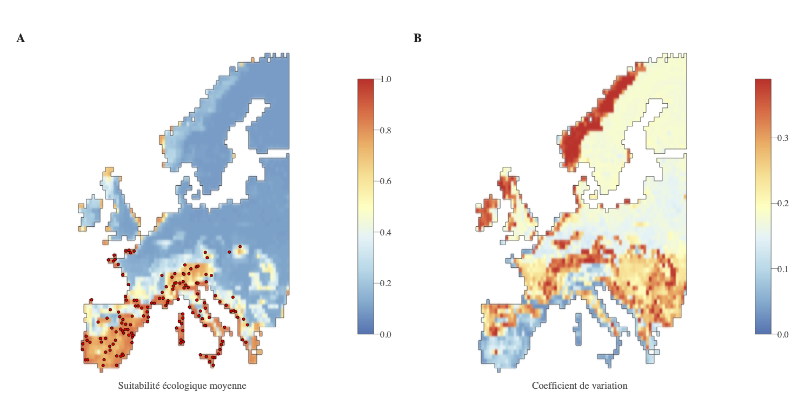

# Dengue-risque-mapping-Europe

This repository contains the R script, input files and selected outputs used for ecological suitability and risk mapping of dengue virus circulation in Europe.

## Repository structure

- `Projet1_Risk_Mapping_Code.R`: main R script used for data loading, exploratory analyses, ecological niche modelling, model evaluation and risk map production.
- `data/occurrences/`: simulated arbovirus occurrence dataset.
- `data/rasters/`: environmental raster predictors used for ecological niche modelling.
- `data/shapefiles/`: coastline shapefile used for map visualisation.
- `outputs/`: selected model outputs, figures and exported rasters.
- `outputs/diagnostic/`: diagnostic outputs used to interpret model behaviour and predictor importance.

## Main analyses

The workflow includes:

- exploration of occurrence data and environmental predictors;
- ecological niche modelling using Boosted Regression Trees (BRT);
- pseudo-absence sampling and replicated model training;
- spatial cross-validation using spatial blocks;
- model performance assessment using AUC and SIppc;
- production of a mean ecological suitability map and uncertainty map;
- diagnostic analyses of predictor effects, relative importance and environmental correlations.

## Ecological suitability map

The final risk map summarises the mean predicted ecological suitability for local dengue virus circulation across Europe, together with spatial uncertainty across BRT replicates.

 

The PDF version is available in:

- `outputs/Fig5_cartographie_risque.pdf`

## Key outputs


## How to run the R script

Before running the script, set the working directory to the repository root folder, which must contain `data/` and `outputs/`.

In R:

```r
source("Projet1_Risk_Mapping_Code.R")
